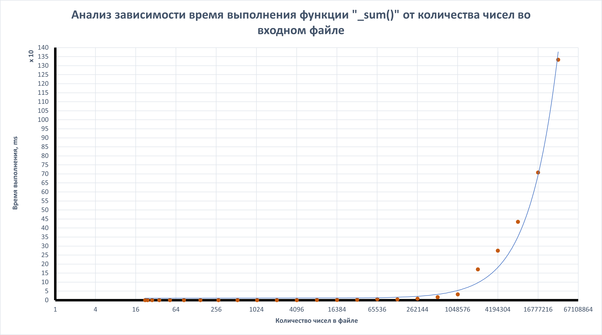

# ТЗ №2 предмета "Технологии программирования" образовательной программы "Бизнес-Информатика" НИУ ВШЭ Москва.

## Описание проекта

##### Эта программа на Java считывает числа из файла и выполняет операции поиска минимального и максимального числа, вычисления суммы и произведения всех чисел. Также предусмотрены тесты для проверки корректности работы функций и измерения их производительности.

## Текущий статус прохождения тестов


## App

##### Основная программа, которая выполняет следующие функции:

- Чтение чисел из файла `src/main/resources/input.txt`.
- Поиск минимального числа.
- Поиск максимального числа.
- Вычисление суммы всех чисел.
- Вычисление произведения всех чисел.
- Вывод итоговых значений в стандартную консоль.

## AppTest

##### Модуль тестирования, который проверяет корректность работы функций программы и их производительность:

- Тестирование функций `_min`, `_max`, `_sum`, `_mult`.
- Проверка работы программы с пустыми файлами.

### Расположение файлов тестирования

- Тестовые файлы находятся в директории `src/test/resources/tests`.
- Ожидаемые результаты тестов находятся в файле `src/test/resources/tests/expectations.txt`.

## Benchmark

##### Модуль для измерения времени выполнения функций программы при обработке файлов разного размера:

- Измерение времени выполнения функций `_min`, `_max`, `_sum`, `_mult`.
- Запись результатов измерений в файлы.

### Расположение файлов для бенчмаркинга

- Входные файлы для тестов производительности находятся в
  директории `src/main/resources/benchmark_tests`.
- Результаты измерений записываются в файлы в той же директории.

## Установка

1. Клонируйте репозиторий:

    ```bash
    git clone https://github.com/altr3s/Software_Engineering_Homework_2
    ```

2. Перейдите в директорию проекта:

    ```bash
    cd Software_Engineering_Homework_2
    ```

3. Соберите проект с помощью Maven:

    ```bash
    mvn clean install
    ```

## Использование

1. Поместите файл `input.txt` с числами в формате `<число_1> <число_2> ...` в
   директорию `src/main/resources`.

2. Запустите программу:

    ```bash
    java -cp target/yourproject-1.0-SNAPSHOT.jar org.example.App
    ```

### Пример файла `input.txt`

`1 4 2 3`

### Ожидаемый вывод

`
Минимальное число: 1
Максимальное число: 4
Сумма чисел: 10
Произведение чисел: 24
`

### Важно! Если вы передадите в пустой файл `input.txt`, то вы получите ошибку в консоли о том, что файл пуст.

## Тестирование

1. Подготовьте файлы с тестовыми данными и ожиданиями в директории `src/test/resources/tests`.

2. Запустите тесты с помощью Maven:

    ```bash
    mvn test
    ```

### Описание тестов

- `testMin`: проверка функции `_min`.
- `testMax`: проверка функции `_max`.
- `testSum`: проверка функции `_sum`.
- `testMult`: проверка функции `_mult`.
- `testEmpty`: проверка работы программы с пустыми файлами.

## Бенчмаркинг

1. Подготовьте тестовые файлы в директории `src/main/resources/benchmark_tests`.

2. Запустите бенчмаркинг:

    ```bash
    java -cp target/yourproject-1.0-SNAPSHOT.jar org.example.Benchmark
    ```

### Описание бенчмаркинга

- `runTest`: выполняет тесты для функций `_min`, `_max`, `_sum`, `_mult` и записывает время
  выполнения в файлы `results-<test_type>.txt`, где <test-type> - тип тестируемой функции.

## Итоги бенчмаркинга

##### После проведения бенчмаркинга и получения данных о выполнении тестов были получены результаты, которые вы можете найти в репозитории в директории `src/main/resources/benchmark_tests/results-<test_type>.txt`.

##### Количество чисел в определенном файле теста можно определить по формуле `20 + 2 ^ <номер теста>`

##### Каждое число не превосходит по модулю 25_000 и является целым.

##### Ниже вы можете найти график зависимости время выполнения функции (в мс) "_sum()" от количества чисел в файле и сводную таблицу.

### Таблица данных

| Номер теста | Время (ms) | Количество чисел в файле |
|-------------|------------|--------------------------|
| 1           | 0.3035     | 22                       |
| 2           | 0.226      | 24                       |
| 3           | 0.2934     | 28                       |
| 4           | 0.2172     | 36                       |
| 5           | 0.192      | 52                       |
| 6           | 0.3035     | 84                       |
| 7           | 0.2596     | 148                      |
| 8           | 0.4292     | 276                      |
| 9           | 0.49       | 532                      |
| 10          | 0.7078     | 1044                     |
| 11          | 1.0032     | 2068                     |
| 12          | 0.9331     | 4116                     |
| 13          | 1.3882     | 8212                     |
| 14          | 2.0648     | 16404                    |
| 15          | 2.9302     | 32788                    |
| 16          | 5.0038     | 65556                    |
| 17          | 4.1306     | 131092                   |
| 18          | 8.3801     | 262164                   |
| 19          | 17.5448    | 524308                   |
| 20          | 33.0031    | 1048596                  |
| 21          | 170.8416   | 2097172                  |
| 22          | 275.3629   | 4194324                  |
| 23          | 434.3964   | 8388628                  |
| 24          | 708.583    | 16777236                 |
| 25          | 1333.2102  | 33554452                 |

### График



## CI/CD

### Описание настройки `maven.yml`:

1. **Инициация Workflow**:
    - Workflow запускается при push-коммитах и pull-реквестах в ветку `main`.

2. **Сборка и тестирование**:
    - **Установка JDK**: Устанавливается JDK версии 17 с использованием `actions/setup-java@v3`.
    - **Сборка и тестирование с Maven**: Выполняется команда `mvn -B package test --file pom.xml`,
      которая собирает проект и запускает тесты.

3. **Сохранение результатов тестирования**:
    - **Сохранение результатов тестов**: При неудачном выполнении тестов создается
      директория `junit` и копируются отчеты из `target/surefire-reports/*.xml`.

4. **Создание отчета об ошибке тестирования**:
    - **Создание отчета**: При неудачном выполнении тестов из отчетов формируется
      файл `failure-report.txt`, содержащий описание ошибок.

5. **Уведомление в Telegram**:
    - **Парсинг данных**: При неудачном выполнении тестов парсится файл `failure-report.txt` с помощью bash скрипта
    - **Уведомление о непройденных тестах**: При неуспешном выполнении тестов отправляется сообщение в Telegram с информацией
      о том, какие именно тесты не прошли.
    - **Уведомление о пройденных тестах**: При успешном выполнении тестов отправляется сообщение в
      Telegram с информацией об успешном прохождении всех тестов.

### Используемые действия:

- `actions/checkout@v4`: Клонирует репозиторий.
- `actions/setup-java@v3`: Устанавливает JDK.
- `appleboy/telegram-action@master`: Отправляет уведомления в Telegram.

---

Этот проект был создан для учебных целей и демонстрирует основы работы с файлами, написания тестов и настройки CI/CD на платформе GitHub.
